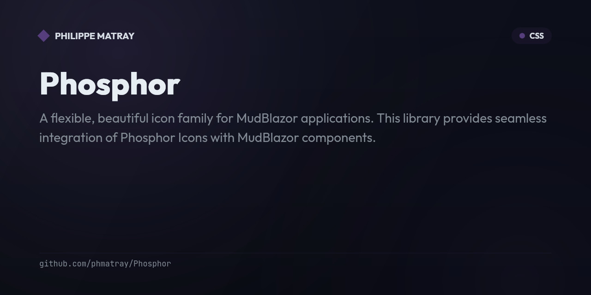

# Phosphor.MudBlazor

<!-- portfolio-badges:start -->
<!-- Identity -->
[](https://github.com/phmatray/Phosphor)

[](https://github.com/phmatray/Phosphor/stargazers)
[](https://github.com/phmatray/Phosphor/network/members)

<!-- Activity -->
[](https://github.com/phmatray/Phosphor/issues)
[](https://github.com/phmatray/Phosphor/pulls)
[](https://github.com/phmatray/Phosphor/commits)
<!-- portfolio-badges:end -->


A flexible, beautiful icon family for MudBlazor applications. This library provides seamless integration of [Phosphor Icons](https://phosphoricons.com/) with [MudBlazor](https://mudblazor.com/) components.

## Features

- **1,500+ Icons**: Access to the complete Phosphor Icons library (v2.1.2)
- **6 Icon Styles**: Choose from Thin, Light, Regular, Bold, Fill, and Duotone variants
- **9,000+ Type-Safe Constants**: Strongly-typed icon constants (1,512 icons × 6 styles) for IntelliSense support
- **MudBlazor Integration**: Works seamlessly with MudIcon and other MudBlazor components
- **Super Icons**: Specialized icon components with parameterized selection (e.g., dice values, battery levels, file types)
- **.NET 10.0**: Built on the latest .NET platform

## Installation

```bash
dotnet add package Phosphor.MudBlazor
```

## Quick Start

### 1. Add the namespace to your `_Imports.razor`:

```razor
@using Phosphor.MudBlazor
@using static Phosphor.Components.Icons
```

### 2. Include the Phosphor CSS in your app:

Add the Phosphor icon fonts to your project and reference them in your `App.razor` or `index.html`/`_Host.cshtml`:

```html
<link rel="stylesheet" href="path/to/phosphor-icons.css">
```

### 3. Use icons in your components:

```razor
@* Basic usage *@
<MudIcon Icon="@Phosphor.Regular.Heart" />
<MudIcon Icon="@Phosphor.Bold.Star" />
<MudIcon Icon="@Phosphor.Fill.ThumbsUp" />

@* With MudBlazor components *@
<MudButton StartIcon="@Phosphor.Regular.Airplane" Variant="Variant.Filled">
    Book Flight
</MudButton>

@* With color and size *@
<MudIcon Icon="@Phosphor.Regular.Radioactive"
         Color="Color.Warning"
         Size="Size.Large" />
```

## Icon Styles

Phosphor Icons come in six distinct styles:

```razor
<MudIcon Icon="@Phosphor.Thin.Heart" />      <!-- Thin -->
<MudIcon Icon="@Phosphor.Light.Heart" />     <!-- Light -->
<MudIcon Icon="@Phosphor.Regular.Heart" />   <!-- Regular (default) -->
<MudIcon Icon="@Phosphor.Bold.Heart" />      <!-- Bold -->
<MudIcon Icon="@Phosphor.Fill.Heart" />      <!-- Fill -->
<MudIcon Icon="@Phosphor.Duotone.Heart" />   <!-- Duotone -->
```

## Super Icons

Super Icons are specialized components that provide parameterized icon selection for related icon sets:

### SuperDiceIcon

Display dice with configurable values and styles:

```razor
<SuperDiceIcon Value="DiceValue.Six" Weight="IconWeight.Bold" />
<SuperDiceIcon Value="DiceValue.Three" Weight="IconWeight.Regular" />
```

### SuperBatteryIcon

Show battery levels with different charge states:

```razor
<SuperBatteryIcon Level="BatteryLevel.Full" Weight="IconWeight.Fill" />
<SuperBatteryIcon Level="BatteryLevel.Low" Weight="IconWeight.Regular" />
```

### Other Super Icons

- **SuperFileIcon**: Different file type icons
- **SuperGenderIcon**: Gender representation icons
- **SuperNumberIcon**: Numbered icons
- **SuperSmileyIcon**: Various smiley expressions

All Super Icons inherit from `SuperIcon` and support the `Weight` parameter to change icon styles dynamically.

## Examples

### In Buttons

```razor
<MudButton StartIcon="@Phosphor.Regular.Download" Color="Color.Primary">
    Download
</MudButton>

<MudIconButton Icon="@Phosphor.Bold.Trash" Color="Color.Error" />
```

### In Navigation

```razor
<MudNavLink Icon="@Phosphor.Regular.House" Href="/">Home</MudNavLink>
<MudNavLink Icon="@Phosphor.Regular.Gear" Href="/settings">Settings</MudNavLink>
```

### Different Colors

```razor
<MudIcon Icon="@Phosphor.Regular.Warning" Color="Color.Warning" />
<MudIcon Icon="@Phosphor.Regular.CheckCircle" Color="Color.Success" />
<MudIcon Icon="@Phosphor.Regular.Info" Color="Color.Info" />
```

### Custom Sizes

```razor
<MudIcon Icon="@Phosphor.Regular.Star" Size="Size.Small" />
<MudIcon Icon="@Phosphor.Regular.Star" Size="Size.Medium" />
<MudIcon Icon="@Phosphor.Regular.Star" Size="Size.Large" />
<MudIcon Icon="@Phosphor.Regular.Star" Style="font-size: 4rem;" />
```

## Project Structure

```
Phosphor/
├── src/
│   ├── Phosphor.MudBlazor/      # Main library package
│   │   ├── Components/          # Super Icon components
│   │   ├── Abstractions/        # Base classes and interfaces
│   │   └── Models/              # Enums and models
│   ├── Phosphor/                # Demo web application
│   │   └── Components/Pages/    # Example pages
│   └── Phosphor.UnitTests/      # Unit tests
├── build/                       # NUKE build configuration
├── input/                       # Source icon fonts
├── output/                      # Generated Icons.cs files
└── artifacts/                   # Build outputs
```

## Building from Source

This project uses [NUKE](https://nuke.build/) as the build system.

### Prerequisites

- .NET 10.0 SDK or later
- Phosphor icon fonts (included in repository)

### Build Steps

```bash
# Clone the repository
git clone https://github.com/yourusername/Phosphor.git
cd src/Phosphor

# Generate Icons.cs from font files
./build.sh GenerateIconsClass   # Linux/macOS
./build.cmd GenerateIconsClass  # Windows (CMD)
./build.ps1 GenerateIconsClass  # Windows (PowerShell)

# Build the solution
dotnet build

# Run tests
dotnet test
```

The build process will:
1. Clean the output directory
2. Parse icon font metadata from `input/fonts/{style}/selection.json` files
3. Convert icon names from kebab-case to PascalCase
4. Generate 9,072 type-safe icon constants in `output/Icons.cs`
5. Link the generated file into the Phosphor.MudBlazor project

### Running the Demo

```bash
cd src/Phosphor
dotnet run
```

Then navigate to `https://localhost:5001` to see the demo application.

## Icon Generation

The icon constants are automatically generated from the Phosphor icon fonts (v2.1.2) using a custom NUKE build script (`build/Build.cs`). The build script:

1. Reads icon metadata from `input/fonts/{style}/selection.json` files for all 6 styles
2. Parses 1,512 unique icon names using the first tag from each icon's metadata
3. Converts kebab-case names (e.g., `thumbs-up`) to PascalCase properties (e.g., `ThumbsUp`)
4. Generates CSS class strings based on icon weight (e.g., `"ph-bold ph-thumbs-up"`)
5. Creates 9,072 type-safe C# constants (1,512 icons × 6 weights) split across 7 partial class files
6. Outputs the result to `output/` directory

To update to a newer version of Phosphor Icons:
1. Download the latest web fonts from [@phosphor-icons/web](https://www.npmjs.com/package/@phosphor-icons/web)
2. Replace files in `input/fonts/` directory
3. Run `./build.sh GenerateIconsClass` to regenerate

## Publishing NuGet Package

To create a NuGet package:

```bash
# Generate icons, build, and pack (creates artifacts/Phosphor.MudBlazor.{version}.nupkg)
./build.sh Pack

# Publish to NuGet.org
dotnet nuget push artifacts/Phosphor.MudBlazor.{version}.nupkg --api-key YOUR_API_KEY --source https://api.nuget.org/v3/index.json
```

The package includes:
- Compiled library (.dll) with icon constants and Super Icon components
- All Phosphor icon fonts (Bold, Duotone, Fill, Light, Regular, Thin) as static web assets
- Main CSS file that imports all font styles
- Symbol package (.snupkg) for debugging support
- README and license information

The generated file structure:

```csharp
namespace Phosphor.Components
{
    public static class Icons
    {
        public static class Phosphor
        {
            public static class Bold
            {
                public const string Heart = "ph-bold ph-heart";
                // ... more icons
            }

            public static class Regular
            {
                public const string Heart = "ph-regular ph-heart";
                // ... more icons
            }

            // ... other styles
        }
    }
}
```

## Contributing

Contributions are welcome! Please feel free to submit a Pull Request.

### Development Guidelines

1. Follow the existing code style
2. Add unit tests for new features
3. Update documentation as needed
4. Run the build script before submitting

## Resources

- [Phosphor Icons](https://phosphoricons.com/) - Official Phosphor Icons website
- [MudBlazor](https://mudblazor.com/) - Official MudBlazor documentation
- [NUKE Build](https://nuke.build/) - Build automation system

## License

Please check the LICENSE file for details.

## Acknowledgments

- [Phosphor Icons](https://phosphoricons.com/) for the beautiful icon set
- [MudBlazor](https://mudblazor.com/) for the excellent Blazor component library
